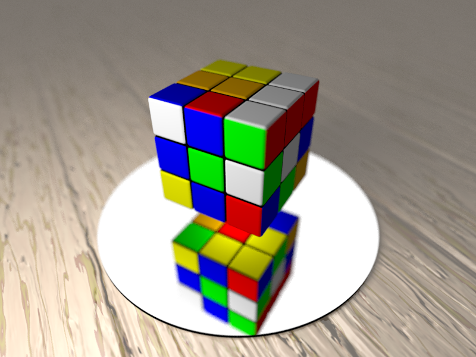

POV-Ray Rubik's Cube
====================

A set of [POV-Ray](http://povray.org) macros for creating Rubik's
Cubes.

The library supports the following features:
- Creating [cubes](doc#simple-cube) and [cuboids](doc#cuboid) of any
  sizes.
- Color schemes [customization](doc#colors-customization).
- [Layers rotation](doc#layers-rotation).
- Extended David Singmaster's
  [notation](doc#david-singmasters-notation).
- Layers rotation [animation](doc#basic-animation) with configurable
  time of [animation beginning and finishing](doc#animation-time-frame).
- Random [cube mixing](doc#cube-mixing).
- [Movements reflection](doc#movements-reflection) - layers rotation
  in the order opposite to a provided one.
- A set of predefined [patterns](doc/patterns-3x3x3) for 3x3x3 cubes.
