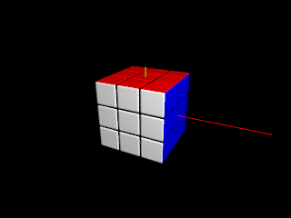

Demo
====

Static Cubes
------------

### Simple Cube ([simple-cube.pov](simple-cube.pov))


A solved classic 3x3x3 cube can be created in just two steps:

1. Create a 3x3x3 cube with the classic color scheme:
   ```
   rubik_cube_create_cube(<3, 3, 3>, rubik_cube_colors_classic)
   ```

2. The macro above returns created cube in a form of a 3D array. Such
   form is not suitable for rendering. The array is converted into an
   object by means of the following macro:
   ```
   rubik_cube_to_object(...)
   ```


### Cuboid ([cuboid.pov](cuboid.pov))


Cuboids of any dimensions (for example, Rubik's Tower) can be created
by altering dimensions:
```
  rubik_cube_create_cube(<2, 4, 2>, ...)
```


### Colors Customization ([custom-colors.pov](custom-colors.pov))


Cube colors can be customized by passing an array of colors into the
`rubik_cube_create_cube()` macro:
```
rubik_cube_create_cube(
  ...,
  array[6] { Wheat, Maroon, SlateBlue, MidnightBlue, Tan, Goldenrod }
)
```

Colors order is the same as used in built-in `cubic` pattern: right,
top, back, left, bottom and front.


Animations
----------

### Cube Mixing ([animation-mix.ini](animation-mix.ini)/[pov](animation-mix.pov))



1. Create a 3x3x3 cube with the classic color scheme:
   ```
   rubik_cube_create_cube(<3, 3, 3>, rubik_cube_colors_classic)
   ```

2. Generate some random layers rotations:
   ```
   rubik_cube_generate_random_movements(
     <3, 3, 3>,   // Cube dimensions.
     5,           // Number of random rotations.
     seed(1)      // Seed for randomizer.
   )
   ```

3. Animate cube (rotate layers according to the current clock
   value):
   ```
   rubik_cube_animate(
     ...
     0,           // Clock value, the animation to be started at.
     1            // Clock value, the animation to be finished at.
   )
   ```

4. Transform cube from its internal representation (3D array) into an
   object:
   ```
   rubik_cube_to_object(...)
   ```


### Movements Reflection ([movements-reflection.ini](movements-reflection.ini)/[pov](movements-reflection.pov))

To return a cube back into its condition after layers rotations, those
rotations can be 'reflected':
```
rubik_cube_reflect_movements(fwd_movements)
```


