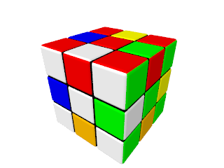
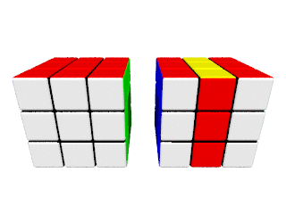
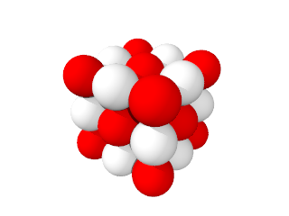

POV-Ray Rubik's Cube
====================

Basics
------

### Cube Size and Dimensions

Each cube consists of a number of pieces, which are kept internally as
a 3D array. The dimensions of a cube are given in a form of a 3D
vector. Each element of this vector corresponds to the cube dimension
along the corresponding axis (in number of pieces).

Pieces are cubes with side of length 1. Therefore, the size of the
generated cube in numerical representation is equal to its
dimensions. The center of the cube is placed in the origin.


### [Simple Cube](simple-cube)


A solved classic 3x3x3 cube can be created in just two steps:

1. Create a 3x3x3 cube with the classic color scheme:
   ```
   rubik_cube_create_cube(<3, 3, 3>, rubik_cube_colors_classic)
   ```

2. The macro above returns created cube in a form of a 3D array. Such
   form is not suitable for rendering. The array is converted into an
   object by means of the following macro:
   ```
   rubik_cube_to_object(...)
   ```


### [Cuboid](cuboid)


Cuboids of any dimensions (for example, Rubik's Tower) can be created
by altering dimensions:
```
  rubik_cube_create_cube(<2, 4, 2>, ...)
```


### [Colors Customization](colors-customization)


Cube colors can be customized by passing an array of colors into the
`rubik_cube_create_cube()` macro:
```
rubik_cube_create_cube(
  ...,
  array[6] { Wheat, Maroon, SlateBlue, MidnightBlue, Tan, Goldenrod }
)
```

Colors order is the same as used in built-in `cubic` pattern: right,
top, back, left, bottom and front.


### [Layers Rotation](layers-rotation)

Layers rotations are given in a form of an array. Each element of the
array is a 4D vector, which describes a layer rotation. The first
three elements of this vector are rotational vector. Only one of those
elements can have a non-zero value. The absolute value of the last
element is index of the layer to be rotated. The minimal index is
zero. The layers are counted along the basis axis. The fact that the
absolute value is used can be used to rotate a layer back by
multiplying a movement vector by -1.


All but the latest rotation in the array must rotate layers on -180,
-90, 0, 90 or 180 degrees, because rotations on other angles
(non-divisible by 90) 'breaks' the cube:
```
rubik_cube_rotate_layers(
  ...,
  array[2] {<-90, 0, 0, 1>, <0, -30, 0, 2>}
)
```

The valid (non the latest) rotations for a non-square cuboid layer are
limited by -180, 0 and 180 degrees, for the same reason. (though real
cuboids can have 'broken' layers)


#### [David Singmaster's Notation](notation)

File [rubik-cube-notation.inc](../rubik-cube-notation.inc) contains
shorthands for writing movements in the
[extended Singmaster's notation](https://en.wikipedia.org/wiki/Rubik%27s_Cube#Move_notation)
for 3x3x3 cubes.



```
#local superflip = array[20] {
  U, R2, F, B, R, B2, R, U2, L, B2, R, -U, -D, R2, F, -R, L, B2, U2, F2
};
```

The letters L, R, F, B, U and D indicate a 90 degrees clockwise turn
of the left, right, front, back, up and down face respectively. 180
degrees turns are indicated by appending a 2. A counterclockwise turn
is indicated by adding `-` before a letter (a prime symbol is used in
the original notation).

The notation is extended with letters M, E and S. They indicate middle
(between L and R), equator (between U and D) and standing (between F
and B) layers respectively.


### [Basic Animation](basic-animation)

Layers rotations can be easily animated:


```
rubik_cube_animate(
  ...
  array[2] {<-90, 0, 0, 1>, <0, -30, 0, 2>},
  ...
)
```


### [Animation Time Frame](animation-time-frame)

The time when an animation should be started and finished can be
easily configured.



```
rubik_cube_animate(
  cube1,
  ...
  0,           // Clock value, the first animation to be started at.
  0.5          // Clock value, the first animation to be finished at.
)
...
rubik_cube_animate(
  cube2,
  ...
  0.5,         // Clock value, the second animation to be started at.
  1            // Clock value, the second animation to be finished at.
)
```


### [Cube Mixing](cube-mixing)


Often it is impractical to mix a cube with a predefined array of
layers rotations. For this reason, random rotations can be generated
by means of a special macro:
```
rubik_cube_generate_random_movements(
  <3, 3, 3>,   // Cube dimensions.
  5,           // Number of random rotations.
  seed(1)      // Seed for randomizer.
)
```

**Attention!** It is important to pass the correct cube dimensions to
the macro, as it takes into account valid rotation angles for
non-square layers.


### [Movements Reflection](movements-reflection)

To return a cube back into its condition after layers rotations, those
rotations can be 'reflected':
```
rubik_cube_reflect_movements(fwd_movements)
```


Advanced Technics
-----------------

### [Piece Generators](piece-generators)

Pieces form can be customized by means of piece generators &mdash;
special macros which can be separatly implemented. Each generator must
be implemented in a separate file. A cube created by a customized
generator is created by the `rubik_cube_generate_cube(...)` macro
instead of `rubik_cube_create_cube(...)`.

A generator implementation must contain only the body of the macro
without `#macro ...` part (because of scene description language
limitations). The macro is taking the following parameters (and so
they are available in the file as predefined variables):
- `dim` &mdash; the cube dimensions (3D vector).
- `pos` &mdash; position of the piece to be generated (3D vector). The
  position coordinates corresponds to the piece number in order from
  left to right, from bottom to top and from front to back.
- `gen_param` &mdash; a parameter which is passed to the generator. If
  several parameters must be passed, they can be combined in an array.

Normally, a generator returns a piece which is embedded into a cube
with coordinates `<0, 0, 0>`, `<1, 1, 1>`.

For example, a cube made of spheres of two alternating colors:



can be created by the following
[piece generator](piece-generators/sphere.inc):
```
sphere {
  0, 0.5
  pigment {
    gen_param[mod(pos.x + pos.y + pos.z, 2)]
  }
  translate 0.5
}
```

The file with such implemetation is then
[passed](piece-generators/sphere.pov) to the
`rubik_cube_generate_cube(...)` macro to create a cube:
```
rubik_cube_generate_cube(
  <3, 3, 3>,              // Cube dimensions.
  "sphere.inc",           // Piece generator.
  array[2] {Red, White}   // Piece generator parameter.
)
```
