Rubik's Cube 3x3x3 Patterns
===========================

File [rubik-cube-patterns-3x3x3.inc](../../rubik-cube-patterns-3x3x3.inc)
contains movements which can be applied to a non-mixed cube to produce
some nice patterns. A lot of patterns are got from site
[ruwix.com](https://ruwix.com).

All patterns have common prefix `rubik_cube_patterns_3x3x3_`. The
suffix `exchanged` means that opposite sides exchanged by pieces. The
suffix `twisted` meanse that adjacent sides exchanged by pieces.


[Anaconda](anaconda)
--------------------
```
rubik_cube_patterns_3x3x3_anaconda
```
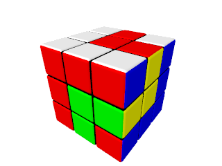


[Black Mamba](black-mamba)
--------------------------
```
rubik_cube_patterns_3x3x3_black_mamba
```
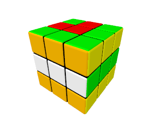


[Center-Edge-Corner](center-edge-corner)
----------------------------------------
```
rubik_cube_patterns_3x3x3_center_edge_corner
```
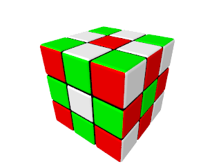


Checkerboards
-------------

### [Exchanged](checkerboard-exchanged)
```
rubik_cube_patterns_3x3x3_checkerboard_exchanged
```
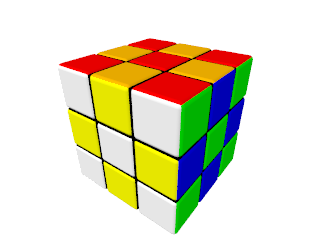


### [Faces](checkerboard-faces)
```
rubik_cube_patterns_3x3x3_checkerboard_with_faces
```


### [Twisted](checkerboard-twisted)
```
rubik_cube_patterns_3x3x3_checkerboard_twisted
```


### [Zigzag](checkerboard-zigzag)
```
rubik_cube_patterns_3x3x3_checkerboard_with_zigzag
```
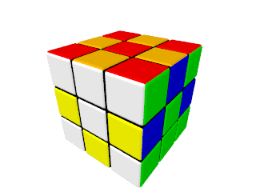


Cross
-----

### [Cross](cross)
```
rubik_cube_patterns_3x3x3_cross
```
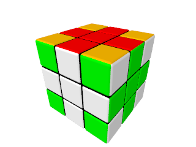


### [Twisted](cross-twisted)
```
rubik_cube_patterns_3x3x3_cross_twisted
```
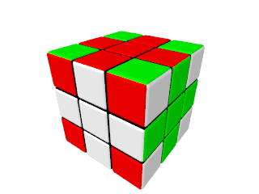


Cube in Cube in ...
-------------------

### [Cube in Cube](cube-in-cube)
```
rubik_cube_patterns_3x3x3_cube_in_cube
```
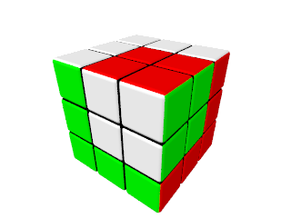


### [Cube in Cube in Cube](cube-in-cube-in-cube)
```
rubik_cube_patterns_3x3x3_cube_in_cube_in_cube
```
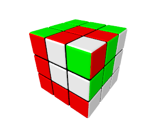


[Green Mamba](green-mamba)
--------------------------
```
rubik_cube_patterns_3x3x3_green_mamba
```
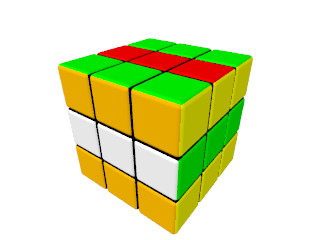


[Opposite Corners](opposite-corners)
------------------------------------
```
rubik_cube_patterns_3x3x3_opposite_corners
```
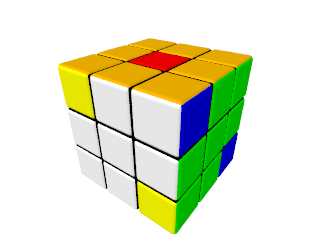


[Python](python)
----------------
```
rubik_cube_patterns_3x3x3_python
```
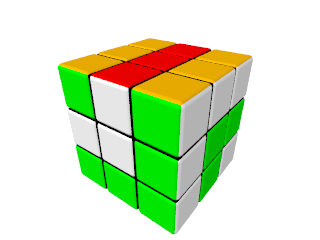


[SpeedSolving.com](speedsolving.com)
------------------------------------
[SpeedSolving.com](https://www.speedsolving.com) site logo.
```
rubik_cube_patterns_3x3x3_speedsolving_com
```
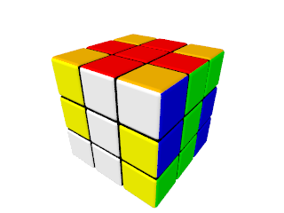


[Spiral](spiral)
----------------
```
rubik_cube_patterns_3x3x3_spiral
```
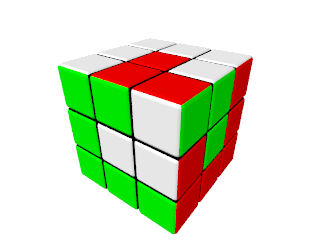


Spots
-----

### [Four](spots-four)
```
rubik_cube_patterns_3x3x3_spots_4
```
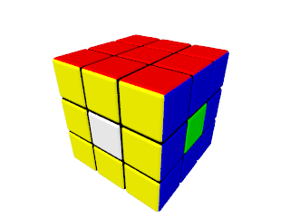


### [Six](spots-six)
```
rubik_cube_patterns_3x3x3_spots_6
```
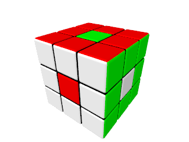


[The Superflip](superflip)
--------------------------
Every piece is where it's supposed to be but the edges are oriented
wrong. It is need the highest amount of steps (20) to solve this
state.
```
rubik_cube_patterns_3x3x3_superflip
```


[Table Cloth](tablecloth)
-------------------------
```
rubik_cube_patterns_3x3x3_tablecloth
```
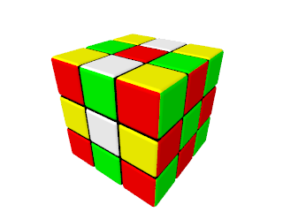


[Tetris](tetris)
----------------
```
rubik_cube_patterns_3x3x3_tetris
```
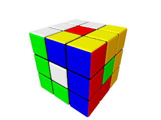


[Twister](twister)
------------------
```
rubik_cube_patterns_3x3x3_twister
```
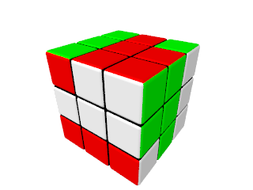


[Vertical Stripes](vertical-stripes)
------------------------------------
```
rubik_cube_patterns_3x3x3_vertical_stripes
```
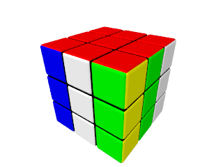


[Wire](wire)
------------
```
rubik_cube_patterns_3x3x3_wire
```
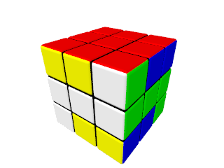
