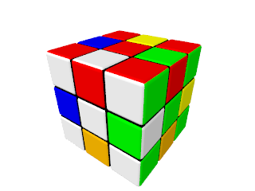

Rubik's Cube 3x3x3 Patterns
===========================

File [rubik-cube-patterns-3x3x3.inc](../rubik-cube-patterns-3x3x3.inc)
contains movements which can be applied to a non-mixed cube to produce
some nice patterns. A lot of patterns are got from site
[ruwix.com](https://ruwix.com).

All patterns have common prefix `rubik_cube_patterns_3x3x3_`. Only the
remaining part of variable names are stated in the table below.

|                    |
|:------------------:|
|  |
| `superflip`        |
